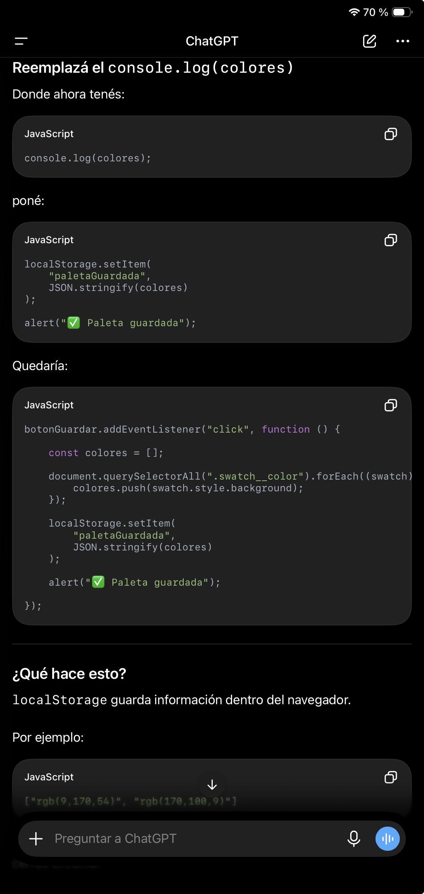
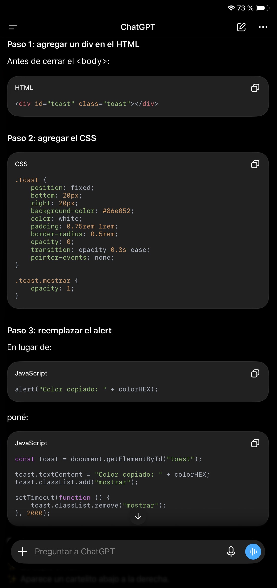
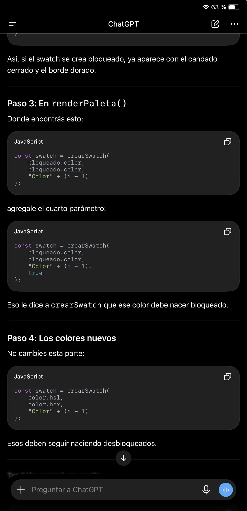

Documentación del uso de Inteligencia Artificial

PROYECTO
Colorfly Studio

---

INTRODUCCIÓN
Durante el desarrollo del proyecto se utilizó ChatGPT como herramienta de apoyo para resolver dudas técnicas, comprender conceptos de JavaScript y mejorar la experiencia de usuario de la aplicación.
Las respuestas obtenidas fueron analizadas, adaptadas e implementadas manualmente durante el desarollo del proyecto.

---

1. Implementación de Local Storage

OBJETIVO
Guardar la última paleta generada para que el usuario pueda volver a visualizarla desde la sección Guardadas.

PROMPT UTILIZADO
¿Cómo puedo guardar una paleta utilizando Local Storage y recuperarla al ingresar a la sección Guaradadas?

RESULTADO OBTENIDO
Se implementó el almacenamiento de la paleta mediante Local Storage, utilizando JSON.stringify() para guardar la información y JSON.parse() para recuperarla posteriormente.

EVIDENCIA

2. Implementación de Toast

OBJETIVO
Mostrar una notificación visual al copiar un color o guardar una paleta.

PROMPT UTILIZADO
Quiero reemplazar los alert por un toast para copiar colores y guardar paletas.

RESULTADO OBTENIDO
Se implementó el componente Toast que aparece durante unos segundos para informar al usuario que la acción se realizó correctamente. El mismo componente se reutilizó para mostrar "Color copiado" y "Paleta guardada".

EVIDENCIA

3. Implementación del bloqueo de colores

OBJETIVO
Permitir bloquear colores individuales para que permanezcan al generar una nueva paleta.

PROMPT UTILIZADO
¿Cómo puedo hacer que un color permanezca fijo cuando genero una nueva paleta?

RESULTADO OBTENIDO
Se implementó un sistema de bloqueo mediante un candado que permite conservar los colores seleccionados mientras el resto de la paleta continúa generándose aleatoriamente.

EVIDENCIA

