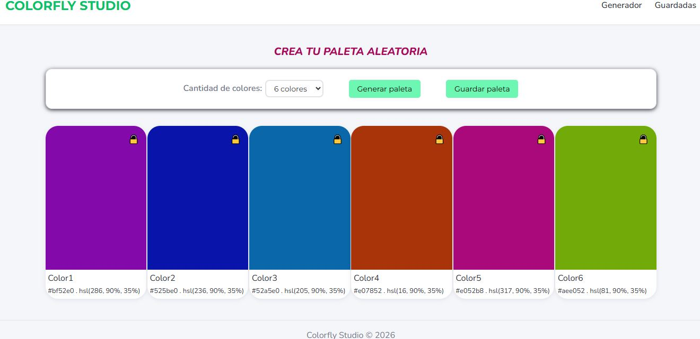
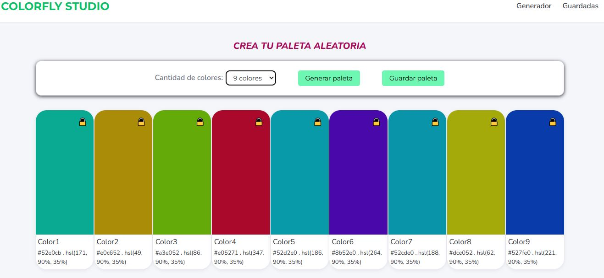
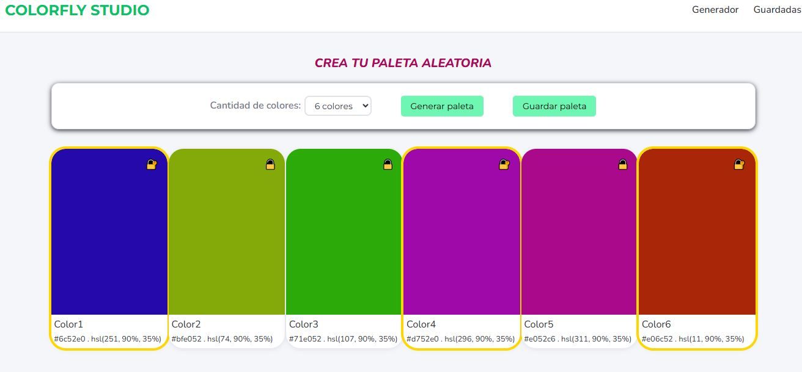
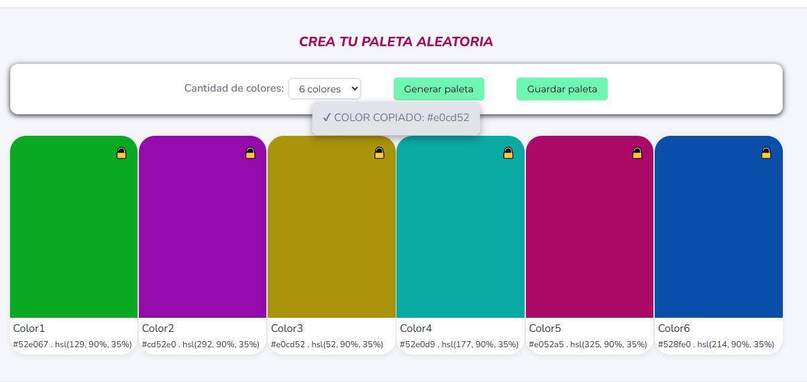
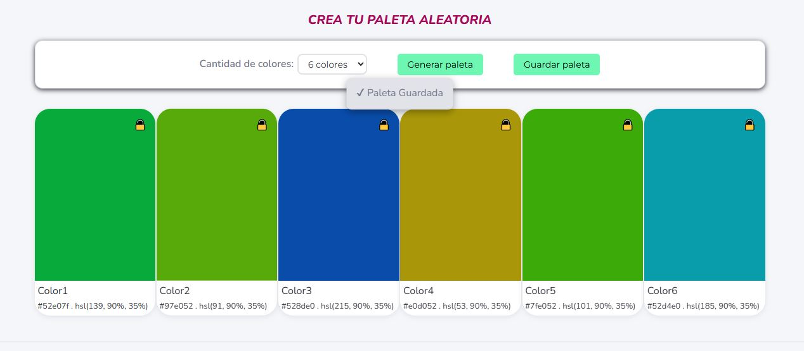
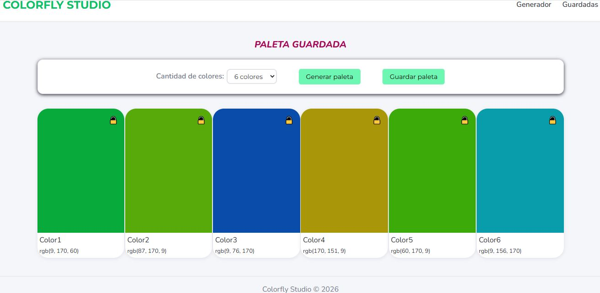

# 🎨 Colorfly Studio

Colorfly Studio es una aplicación web desarrollada con HTML, CSS y JavaScript que permite generar paletas de colores aleatorias para proyectos de diseño y desarrollo web. El usuario puede generar paletas de 6, 8 o 9 colores, bloquear aquellos que desea conservar, copiar fácilmente los códigos de color y guardar su paleta favorita utilizando Local Storage.

---

## 🚀 Demo

---

## 📷 Capturas

### Pantalla principal



---

### Cambio cantidad de colores



---

### Colores bloqueados



---

### Color copiado



---

### Paleta guardada



---

### Vista de paleta guardada



---

## ⚡ Funcionalidades

- Generación aleatoria de paletas.
- Selección de 6, 8 o 9 colores.
- Visualización de colores en formato HEX y HSL.
- Bloqueo individual de colores mediante candado.
- Copia de colores al portapapeles al hacer click sobre un color.
- Guardado de paletas utilizando Local Storage.
- Visualización de la última paleta guardada.
- Notificaciones visuales para acciones realizadas.
- Navegación entre Generador y Guardadas.

---

## 🛠️ Tecnologías utilizadas

- HTML5
- CSS
- JavaScript
- Git 
- GitHub
- GitHub Pages

---

## 📂 Estructura del proyecto

```
📁 ProyectoM1_JulianaGusella
│
├── assets/
│   └── capturas
│
├── css/
│   └── styles.css
│
├── js/
│   └── index.js
│
├── DOCUMENTACION_IA.md
├── index.html    
└── README.md
```

---

## ▶️ Cómo utilizar

1. Seleccionar la cantidad de colores.
2. Presionar "Generar paleta".
3. Hacer click sobre un color para copiarlo.
4. Utilizar el candado para bloquear colores.
5. Presionar "Guardar paleta" para almacenarla.
6. Acceder a la sección "Guardadas" para visualizar la paleta guardada.

---

## 💡 Funcionalidades extra

- Toast de confirmación al copiar colores.
- Toast de confirmación al guardar paletas.
- Navegación entre Generador y Guardadas.
- Bloqueo de colores con candado.
- Persistencia de datos mediante Local Storage.

---

# 👩‍💻 Autora

Juliana Gusella

Proyecto Integrador del Módulo 1 Full Stack Developer - Soy Henry